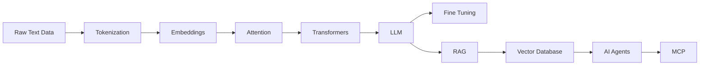
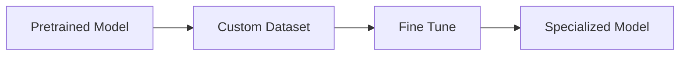
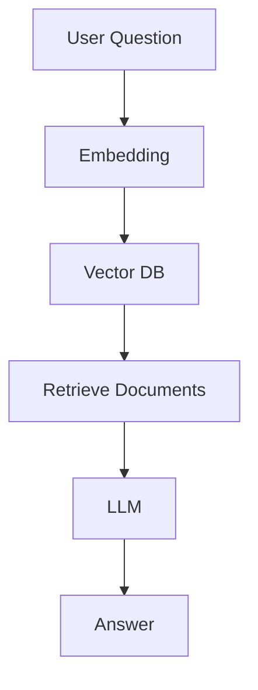
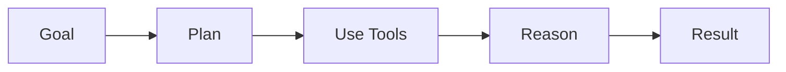

# AI_ML_P123
# 🚀 Large Language Models (LLMs) & Generative AI Notes

<div align="center">


### 📚 Complete Beginner-to-Intermediate Guide to LLMs

</div>

---

## ⭐ **IMPORTANT: Additional Learning Resources**

### **[📖 Access the Complete Google Doc with Detailed Notes and Examples](https://docs.google.com/document/d/1AJ_4KaZTWQm4HFPTUWuYNhNfQOPtuX2MdfmmHDFO2bE/edit?usp=sharing)**

---

## 🗺️ Learning Roadmap



---

# 🧠 1. Large Language Models (LLMs)

> LLMs are AI models trained on massive text datasets to predict the next token.

### ✨ Capabilities

| Feature          | Example            |
| ---------------- | ------------------ |
| 💬 Chat          | ChatGPT            |
| 📝 Writing       | Blogs, Emails      |
| 🌍 Translation   | English → Hindi    |
| 📄 Summarization | Research Papers    |
| 💻 Coding        | Python, JavaScript |

### ⚙️ Working

```text
Training Data
      ↓
Transformer Model
      ↓
Learn Patterns
      ↓
Generate Text
```

---

# 🔤 2. Tokenization

Tokenization converts text into tokens.

### Example

```text
"Tokenization is fun"
```

Becomes

```text
["Token", "ization", " is", " fun"]
```

### Why Important?

✅ Models understand tokens, not words

✅ Determines context length

✅ Affects API cost

---

# 📊 3. Embeddings & Vectors

Embeddings convert text into numerical representations.

### Visualization

```text
Cat      ●
         |
         |
Kitten   ●

Car                 ●
```

### Benefits

* Semantic Search
* Recommendations
* RAG Systems
* Similarity Matching

---

# 🎯 4. Attention Mechanism

Attention helps the model focus on relevant information.

### Example

```text
Nidhi submitted her assignment.
           ↑
         "her" refers to Nidhi
```

### Types

| Type                 | Purpose                |
| -------------------- | ---------------------- |
| Self Attention       | Same sequence          |
| Multi Head Attention | Multiple relationships |

---

# 🤖 5. Transformers

The architecture behind modern LLMs.

```text
Input Tokens
      ↓
Embeddings
      ↓
Self Attention
      ↓
Feed Forward Network
      ↓
Output
```

### Core Components

* 🔤 Token Embeddings
* 📍 Positional Encoding
* 🎯 Attention
* 🧠 Feed Forward Networks
* 🔄 Residual Connections

---

# 🎓 6. Fine Tuning

Fine-tuning adapts a pretrained model for a specific task.

### Workflow



### Example

Customer Support Chatbot trained using company tickets.

---

# 📝 7. Few Shot Prompting

Teaching the model through examples.

### Prompt

```text
Input: Great product
Output: Positive

Input: Bad service
Output: Negative

Input: Average experience
Output:
```

### Result

```text
Neutral
```

---

# 📚 8. RAG (Retrieval-Augmented Generation)

RAG allows LLMs to answer using external documents.

### Architecture



### Benefits

✅ Reduced hallucinations

✅ Up-to-date information

✅ Company knowledge integration

---

# 🗄️ 9. Vector Database

Stores embeddings and performs similarity search.

### Popular Databases

| Database | Popularity |
| -------- | ---------- |
| Pinecone | ⭐⭐⭐⭐⭐      |
| ChromaDB | ⭐⭐⭐⭐       |
| Weaviate | ⭐⭐⭐⭐       |
| Milvus   | ⭐⭐⭐⭐       |
| Qdrant   | ⭐⭐⭐⭐       |

---

# 🔌 10. MCP (Model Context Protocol)

Standardized communication between AI and tools.

### Example

```text
AI Assistant
      ↓
MCP Server
      ↓
Database / API / Files
```

### Use Cases

* Internal Documents
* Databases
* APIs
* Calendar Systems

---

# 🏗️ 11. Context Engineering

The art of providing the right context to the model.

### Components

| Component    | Purpose       |
| ------------ | ------------- |
| Instructions | What to do    |
| User Query   | Task          |
| RAG Context  | Knowledge     |
| Tool Results | External Data |
| Examples     | Guidance      |

---

# 🤖 12. AI Agents

Agents perform multi-step tasks autonomously.

### Example Workflow



### Examples

* Research Agent
* Coding Agent
* Customer Support Agent

---

# 🎮 13. Reinforcement Learning

Learning through rewards and penalties.

```text
Action
   ↓
Reward / Penalty
   ↓
Learning
```

### Goal

Maximize cumulative reward.

---

# 🔍 14. Chain of Thought (CoT)

Step-by-step reasoning process.

```text
Question
   ↓
Reasoning Steps
   ↓
Final Answer
```

### Benefits

* Better logic
* Improved accuracy
* Fewer mistakes

---

# 🧩 15. Reasoning Models

Reasoning-focused models spend extra compute to solve difficult problems.

### Trade-Off

| Faster Models | Reasoning Models |
| ------------- | ---------------- |
| ⚡ Fast        | 🧠 Accurate      |
| Less Compute  | More Compute     |

---

# 🖼️ 16. Multimodal Models

Can understand multiple data types.

### Modalities

* 📝 Text
* 🖼️ Image
* 🎙️ Audio
* 🎥 Video

### Examples

* GPT
* Gemini
* Claude

---

# 📱 17. Small Language Models (SLMs)

Smaller and cheaper alternatives to LLMs.

### Advantages

✅ Fast

✅ Low Cost

✅ Edge Deployment

### Examples

* Phi
* Gemma
* TinyLlama

---

# 🏆 18. Distillation

Knowledge transfer from a large model to a smaller model.

```text
Teacher Model
       ↓
 Knowledge
       ↓
Student Model
```

### Benefits

* Lower Cost
* Faster Inference
* Smaller Size

---

# ⚡ 19. Quantization

Reducing precision to improve speed.

```text
FP32
 ↓
FP16
 ↓
INT8
 ↓
INT4
```

### Advantages

✅ Faster Inference

✅ Lower Memory

✅ Cheaper Deployment

---

# 🎯 Interview Cheat Sheet

| Concept      | One-Line Definition        |
| ------------ | -------------------------- |
| Tokenization | Text → Tokens              |
| Embeddings   | Text → Vectors             |
| Attention    | Focus on relevant tokens   |
| Transformer  | Core LLM architecture      |
| Fine-Tuning  | Specialize a model         |
| RAG          | Retrieve before generating |
| Vector DB    | Stores embeddings          |
| MCP          | Connects AI to tools       |
| Agent        | AI with tools & planning   |
| RL           | Learning via rewards       |
| CoT          | Step-by-step reasoning     |
| SLM          | Small language model       |
| Distillation | Compress large models      |
| Quantization | Reduce model size          |

---

<div align="center">

## ⭐ If these notes helped you, give the repository a star!

🚀 Happy Learning GenAI & LLMs 🚀

</div>
